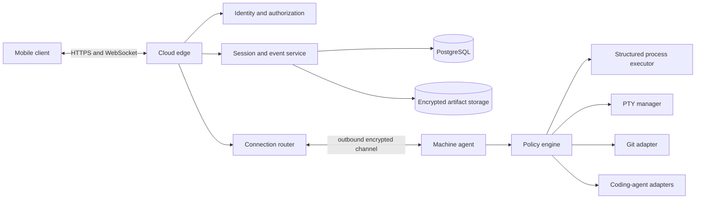
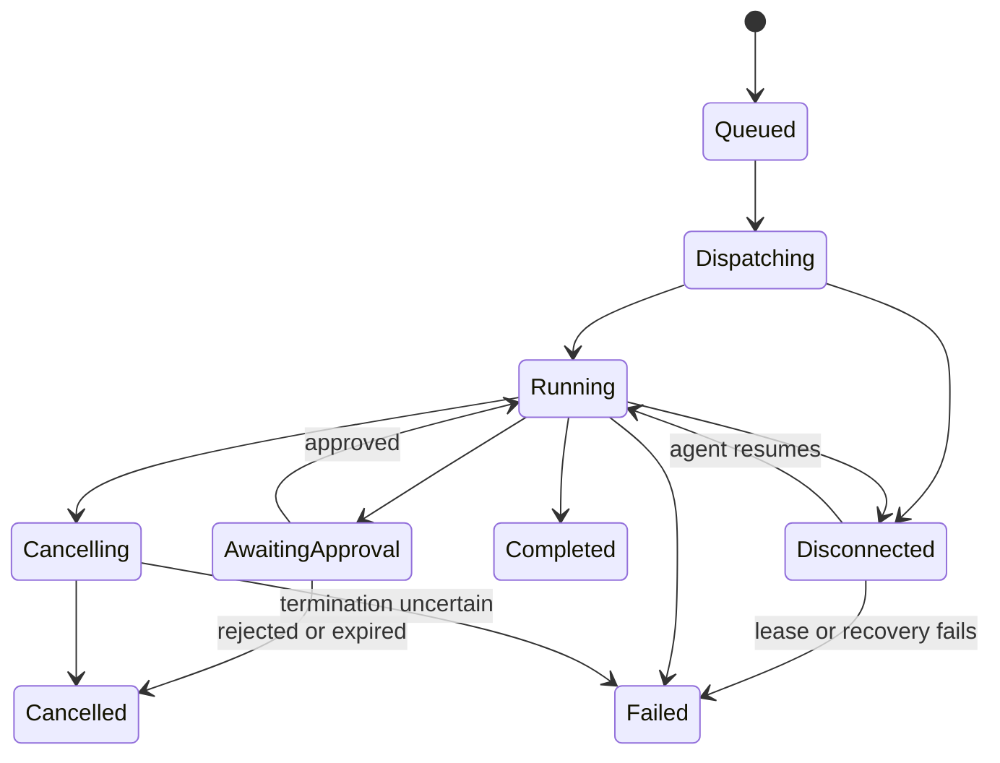

# Conatus Mobile Technical Specification

> **Current architecture amendment:** ADR 0009 selects a native Swift Mac app,
> TypeScript Core, local Swift runtime/Gateway, PostgreSQL/SQLite persistence,
> and shared Swift/TypeScript contracts. Older Android/Rust/Linux sections remain
> historical or future evidence where the ADR supersedes them.

**Status:** Approved direction with recorded follow-up decisions  
**Depends on:** [Product specification](product-spec.md), [Threat model](threat-model.md), [Foundation ADR](decisions/0001-foundation.md)

## 1. Objective

Define a production architecture for secure, resumable interaction between mobile clients and developer machines. The system must support structured commands, coding agents, approvals, Git review, and interactive PTY sessions without opening inbound machine ports.

This is an independent implementation. Warp's repository is architectural prior art only; AGPL-covered application code must not be copied into Conatus unless an explicit licensing decision changes this constraint.

The first delivery boundary and dependency-ordered work are defined in [Alpha scope](alpha-scope.md) and the [implementation backlog](implementation-backlog.md).

### Mac managed-voice boundary

The Mac voice path is a product-owned lifecycle with four replaceable local
boundaries: `WakeDetector`, `TurnCapture`, `Transcriber`, and `SpeechOutput`.
Local wake classification starts a post-wake capture and immediate feedback;
it does not perform semantic command transcription. Core authenticates the
Conatus account and owns voice admission, quota, and short-lived grants. A
transcription adapter reconciles provider events to provider-neutral Voice Turn
IDs. Only one non-empty final transcript per Voice Turn ID can enter Task
routing; partial transcripts are presentation only.

The native lifecycle states are `off`, `armed`, `acknowledging`, `capturing`,
`transcribing`, `routing`, `working`, `speaking`, `recovering`, and `blocked`.
Its public projection contains only schema version, lifecycle state,
conversation mode, and recoverability. Raw audio, transcript text, provider
identifiers, credentials, paths, raw output, and Codex references are private
to their narrow owning boundary and are excluded from public status and default
telemetry.

The first local wake implementation uses Apple Sound Analysis with a
Conatus-owned custom Core ML sound classifier. The framework is an acoustic
classifier behind `WakeDetector`, not semantic transcription. Before the model
is available, the platform-independent audio kernel accepts ordered mono sample
frames, retains a separately bounded rolling window, commits only the locally
accepted activation range plus subsequent command audio, gates repeated scores,
and closes the turn through local energy/silence limits. The native microphone
adapter checks authorization before touching the input node, deep-copies each
non-interleaved Float32 tap buffer, and assigns monotonically increasing sample
positions. Sound Analysis receives those copies on one dedicated serial queue;
the real-time callback never performs classification. A strict manifest binds
the future Core ML filename and SHA-256 digest to commercial distribution,
training-source, recipe, label, audio-format, evaluation, accent, and hardware
evidence. No model is compiled until that manifest passes. M2-02b1 verifies
this adapter boundary synthetically; actual microphone use, the model artifact,
and hardware/audio-route evidence remain M2-02b2.

The offline model-production path is separate from the app runtime. A strict
manifest points only to an external dataset and records opaque subjects,
consent references, approved licenses, per-clip SHA-256 values, recording
sessions, immutable splits, labels, and audio metadata. Validation rejects
session leakage and requires a wake subject in testing that is absent from
training. Create ML receives a private copied snapshot whose digest is checked
after copying, fixed validation data, and a pinned recipe. Only held-out test
clips contribute to the evaluation-corpus digest. Overlapping background
windows contribute false accepts; a wake clip contributes one false reject only
when none of its windows detects the phrase. Model and runtime manifest
publication is atomic. This tooling never records audio and is not linked into
`ConatusMac`.

The collection boundary is also separate from both the app and trainer. A
strict versioned receipt records opaque participant, controller,
withdrawal-contact, and operator-approval references; raw-audio deletion and
model-release cutoff dates; plus affirmative training, evaluation, and
derived-model-distribution consent. Adults and absence of third-party voices
must be confirmed; raw-audio publication is prohibited. A deterministic take
state machine cannot emit a recorder-start directive before validated consent,
requires ordered 16 kHz mono digest evidence, and exposes only state and counts.
It contains no recorder backend; collection and training remain an explicitly
approved later operation outside Git.

Core's voice authority is a separate durable boundary. Authenticated server
context supplies account and principal IDs. Issue atomically locks the account
quota and UTC-day usage ledger, reclaims expired reservations, enforces one
active grant, and reserves at most five minutes and ten turns. Core returns one
opaque five-minute Conatus relay token and stores only its SHA-256 digest.
Relay admission moves reserved audio to consumed audio while decrementing turns;
revocation, expiry, and exhaustion release unused reservation. Durable events
contain only grant IDs, state, timestamps, scope, and numeric usage. Provider
credentials stay behind the future relay and are never returned by this contract.

## 2. System boundaries



### Trust boundaries

1. Mobile OS and secure key storage
2. Public network and cloud edge
3. Multi-tenant control plane
4. Encrypted routing channel
5. Developer machine and local agent
6. Child processes, repositories, tools, and coding-agent providers

The cloud authenticates routing metadata and authorization but should not require plaintext access to command, terminal, file, or diff payloads in the default privacy mode.

## 3. Technology decisions

### Mobile client

- Native Kotlin and Jetpack Compose, targeting Android internal builds first;
  native Swift/SwiftUI iOS work is deferred until physical-device validation is
  available.
- A custom Android terminal `View` uses a Rust parser through a narrow,
  versioned JNI boundary. Kotlin remains authoritative for rendering, IME,
  selection, TalkBack, lifecycle, secure keys, and platform integrations.
- Encrypted local persistence for session metadata and event projections.
- Generated Kotlin API and protocol types; handwritten network DTO duplication
  is prohibited.

### Machine agent

- Rust with Tokio.
- Linux is the only supported machine platform for alpha and the initial public product. Portability must not complicate the Linux implementation prematurely.
- The alpha machine-agent durable security-state directory must be on exact
  `ext4`. Startup probes the directory's kernel mount ID and bounded
  `/proc/self/mountinfo` entry before creating identity, nonce, or encrypted
  outbox state. Missing, ambiguous, or non-`ext4` results fail closed with an
  actionable compatibility error. This constraint does not by itself prohibit
  workspaces on other filesystems.
- Separate modules for connection, cryptography, policy, process execution, PTY, filesystem, Git, agent adapters, updates, and audit.
- Least-privileged execution as the logged-in user. Elevation is outside v1.

### Control plane

- Rust services using Tokio and a conventional HTTP/WebSocket framework selected by ADR.
- PostgreSQL as the authoritative store for identity, membership, routing metadata, sessions, event envelopes, cursors, approvals, and audit records.
- Object storage for bounded encrypted artifacts.
- Redis may hold leases, presence, and rate-limit counters but is never authoritative for accepted commands or approval decisions.
- OpenTelemetry-compatible traces, metrics, and structured logs with content-denylisting.
- Railway is the alpha hosting platform, with managed PostgreSQL and private service networking. The application remains portable through containers, migrations, and explicit infrastructure configuration.

## 4. Core domain model

```text
Organization
  User
  Device
  Machine
  Workspace
    Session
      Run
        RunEvent
        Approval
        Artifact
```

### Session

A durable conversation and execution timeline associated with a workspace and normally a machine. A session may survive machine disconnection.

### Run

One accepted user intent. A run has immutable initiation metadata and a state derived from its events. Retries create linked runs.

### Run event

An immutable fact appended to a session stream. Corrections are additional events. Event payloads are versioned independently from the transport envelope.

### Block projection

A deterministic client or service projection of events. Blocks can be cached, but durable events remain authoritative.

### Approval

A durable authorization challenge bound to a canonical operation digest, principal, machine, context, policy version, and expiration.

## 5. Identifiers and ordering

- Public identifiers use UUIDv7 or an equivalent time-sortable, non-enumerable identifier.
- Each session has a monotonically increasing `sequence` assigned transactionally by the authoritative event service.
- `event_id` provides global identity; `(session_id, sequence)` provides stream ordering.
- Client submissions include an idempotency key unique within the user and organization scope.
- Machine operations include an operation ID and attempt ID. Retrying transport does not create another operation attempt.
- Timestamps are informational and never determine authoritative ordering.

## 6. Protocol envelope

The logical envelope is serialized with a schema technology that preserves unknown fields and supports generated clients. Protobuf is the initial recommendation; JSON representations may be exposed for diagnostics.

```proto
message EventEnvelope {
  uint32 protocol_version = 1;
  string event_id = 2;
  uint64 sequence = 3;
  string organization_id = 4;
  string workspace_id = 5;
  string session_id = 6;
  string run_id = 7;
  string machine_id = 8;
  string event_type = 9;
  uint32 payload_version = 10;
  google.protobuf.Timestamp occurred_at = 11;
  bytes encrypted_payload = 12;
  bytes authenticated_metadata = 13;
}
```

Protocol rules:

- Unknown event types and fields are preserved when relayed or cached.
- Payload size is bounded by event type.
- Large content is an encrypted artifact referenced by digest and capability-bound URL.
- Every encrypted payload authenticates the routing metadata that must not be substituted.
- Compression happens before encryption and is disabled or padded for payload classes where size leakage is material.
- Protocol negotiation selects a mutually supported version before mutations are enabled.

## 7. Run state machine



States are projections. Transitions are validated when appending events. Terminal states are immutable. An `unknown_outcome` flag may accompany failure when dispatch or termination cannot be proven; reconciliation must resolve it before a retry is suggested.

## 8. Event taxonomy

Initial stable event families:

```text
session.created
session.context_changed

run.queued
run.dispatched
run.started
run.awaiting_approval
run.cancelling
run.cancelled
run.completed
run.failed

agent.message_delta
agent.message_completed
agent.tool_requested
agent.tool_completed
agent.tool_failed

command.started
command.stdout
command.stderr
command.exited
command.output_truncated

approval.requested
approval.granted
approval.rejected
approval.expired
approval.consumed

git.status_observed
git.diff_observed
file.change_observed
test.result_observed

pty.started
pty.output_checkpoint
pty.resized
pty.input_audited
pty.exited

connection.interrupted
connection.resumed
```

High-volume PTY bytes use a bounded streaming channel. Durable PTY checkpoints and lifecycle events belong in the event stream; individual keystrokes and frames do not become ordinary database rows.

## 9. Command dispatch and execution

### Structured process execution

The normal executor accepts an executable and argument vector rather than a shell command string. It also accepts a canonical working directory, a policy-approved environment-variable map, time and output limits, and declared interaction mode.

Shell syntax is a distinct execution type and is presented as such during approval. No component may convert structured arguments into an interpolated shell string.

### Dispatch sequence

1. Client submits an intent with an idempotency key and encrypted payload.
2. Control plane authorizes metadata and transactionally creates the run and queued event.
3. Router forwards the encrypted request to the connected machine agent.
4. Machine decrypts, validates freshness and identity, resolves canonical targets, and evaluates local policy.
5. If approval is required, the machine creates a canonical operation digest and returns an approval challenge.
6. After a valid decision, the machine executes and streams events.
7. Control plane durably accepts envelopes before acknowledging their sequence.
8. Machine retains a bounded resend buffer until acknowledgement.

### Resource controls

- Configurable wall-clock timeout
- Output byte and rate limits
- Child-process tree cancellation
- File-descriptor and concurrent-run limits
- Artifact size and retention limits
- Backpressure from mobile through control plane to machine

## 10. Approval protocol

The machine agent canonicalizes the operation before requesting approval. The digest covers:

```text
operation type
executable and ordered arguments
canonical working directory
environment variable names and approved value hashes
canonical resource identifiers
machine and workspace identifiers
initiating principal and device
policy version and risk class
nonce and expiration
```

Approval decisions are signed by the mobile device key and reference the digest. The machine verifies signature, membership, revocation, nonce, expiration, policy version, and unused status. Consumption is atomic with execution admission. Destructive operations require an in-app confirmation; push actions may only open the approval screen.

## 11. Pairing, identity, and keys

1. User authenticates through OIDC with phishing-resistant options supported where available.
2. Each mobile device and machine generates its own non-exportable or OS-protected key pair.
3. Pairing begins with a short-lived server-issued challenge and is confirmed on both endpoints.
4. Pairing establishes device and machine certificates plus the keys required for encrypted session envelopes.
5. The control plane records public keys, attestable metadata when available, status, and revocation generation.
6. Revocation updates are pushed and also checked on every reconnect and sensitive operation.

Successful pairing produces an immutable, endpoint-signed
`PairedEndpointRecord` stored by both endpoints. Later key resolution must chain
to that local record; the control-plane key directory is not a cryptographic
trust root.

Pairing and recovery use the fixed
`Noise_XXpsk3_25519_ChaChaPoly_SHA256` pattern with a locally transferred
32-byte secret, a context-bound prologue, encrypted endpoint bundles, a full
128-bit comparison value, local confirmation on both endpoints, and
post-handshake endpoint signatures. Each endpoint permits one local attempt per
secret and never resumes a partial handshake after restart or restore. The
[pairing and recovery specification](protocol/pairing-and-recovery.md) defines
the semantic transcript and failure rules. The
[cryptographic byte profile](protocol/cryptographic-byte-profile.md) fixes the
version-1 transcript and signature bytes.

Each session uses a single mobile content authority during alpha. The authority
signs state proposals, while the paired target machine is the unique commit
sequencer and signs one durable `SessionStateCommit` for each state sequence.
Recipients adopt no session root, epoch, content grant, authority transfer, or
revocation transition without both the required mobile endpoint authorization
and the matching machine commit. Recipient changes, historical grants,
authority transfers, and revocation replacements require the device approval
key; a routine same-recipient epoch rotation may use the authority identity key.

The exact objects, signer predicates, canonical-successor rule, fork behavior,
partition behavior, and compromise consequences are defined in the proposed
[cryptographic authority state model](protocol/cryptographic-authority-state.md).
Its byte encoding is fixed by the proposed R5 profile and remains blocked on
cross-language implementation evidence and independent review.

Account recovery creates no content capability. Trusted-device and
local-machine recovery separately name `pair-only`, future-content, bounded
historical-content, or replacement-authority scope. Future and historical
access never imply one another. Replacement authority requires local endpoint
authorization and forces a new epoch.

Key rotation, account recovery, organization ownership recovery, and lost-device behavior require dedicated ceremonies and tests; recovery must not silently bypass end-to-end confidentiality.

[ADR 0008](decisions/0008-cryptographic-architecture.md) proposes the exact
pairing, identity, key-wrapping, session-encryption, rotation, revocation, and
recovery construction. It is not an accepted implementation decision until the
C-007 [independent review](cryptographic-design-review.md) closes every critical
and high finding. Production cryptography remains blocked until then.

## 12. Connection and reconnection

- Mobile and machine use authenticated WebSocket connections over TLS 1.3 where supported.
- The machine always initiates the network connection; no inbound port is required.
- Heartbeats maintain presence leases but do not define durable run state.
- A reconnect provides the last durable session sequence and last acknowledged machine frame.
- The service replays durable events after the cursor, then switches to live delivery.
- Duplicates are accepted at transport boundaries and eliminated by event and operation identifiers.
- If replay history is compacted, the client receives a signed snapshot plus the next sequence.
- Slow consumers are disconnected with a resumable reason rather than allowed unbounded buffering.

## 13. PTY design

- PTY sessions have independent identifiers, leases, dimensions, and lifecycle state.
- Raw input is sent only while the client holds a device-requested,
  machine-granted input lease; observation may be shared.
- Lease transfer is explicit to prevent two devices from concurrently typing unintentionally.
- Every lease generation and reconnect establishes a fresh pairwise
  `Noise_KK_25519_ChaChaPoly_SHA256` channel using dedicated static keys pinned
  during pairing or recovery; session epoch keys never authenticate PTY input.
- The machine authenticates each frame, validates its exact next sequence and
  current lease generation, rechecks revocation and policy, and reserves its
  frame ID before any input, resize, or signal reaches the PTY.
- The machine retains a bounded terminal screen/scrollback representation or checkpoint stream.
- Reconnect includes a fresh screen snapshot and subsequent frames; the UI labels unavailable history.
- Resize operations are ordered and idempotent.
- Sensitive-mode controls can disable cloud retention, clipboard, and screenshots where platform capabilities permit.

Durable envelopes are signed by their eligible endpoint before recipients
decrypt or act. Artifact chunks remain quarantined until a sender-signed
finalization validates the complete ordered ciphertext chain. The proposed
[sender-authenticated content specification](protocol/sender-authenticated-content.md)
defines these C-007-R3 semantics. The proposed
[nonce and retry state specification](protocol/nonce-and-retry-state.md)
requires a fresh signed sender incarnation, transactional counter allocation,
an immutable outbox commit before transmission, and byte-for-byte retry.
Restarts may relay old durable bytes but cannot resume their encryption state;
unsupported or uncertain restore/clone state is quarantined. Exact encodings
and executable R4 fault evidence remain pending.

## 14. Agent adapter interface

Each coding-agent integration implements:

```text
discover
capabilities
start_session
resume_session
submit_prompt
cancel
normalize_event
request_approval
health
```

Normalized events retain provider name, provider protocol version, provider session ID, and an encrypted raw event. Provider-specific states map to product states without inventing completion or success. Unsupported provider events use a generic diagnostic block.

## 15. Persistence

Authoritative relational entities include organizations, users, memberships, devices, machines, workspaces, sessions, runs, event envelopes, approvals, artifacts, revocations, and audit entries.

Requirements:

- Append and sequence assignment occur in one database transaction.
- Approval decision and single-winner conflict handling are transactional.
- Payload ciphertext is immutable.
- Deletion uses a documented tombstone and asynchronous encrypted-artifact
  purge process. Where an artifact has a sole local wrapped content-key object,
  purge unlinks and directory-syncs that key object before ciphertext removal;
  this is application-level cryptographic erasure, not physical-media overwrite
  and not deletion of backup or replica copies.
- Backups are encrypted, access-audited, restored regularly, and covered by retention policy.
- Every schema migration has forward validation and a tested recovery strategy.

## 16. Observability and privacy

Allowed telemetry includes opaque identifiers, event types, sizes, latency, state transitions, protocol versions, error classes, and resource counters.

Disallowed by default:

- Commands and arguments
- Terminal output or input
- File contents and diffs
- Repository paths and names
- Agent prompts and responses
- Environment values
- Decrypted artifact content

Operational tooling uses explicit, time-bounded support access with user or organization authorization where content access is ever offered. Security audit logs are immutable and separated from application diagnostics.

## 17. Deployment and operations

- Services run in multiple failure domains before public beta.
- Infrastructure changes are reviewed and reproducible.
- Production secrets come from a managed secret store and never from repository files.
- Database migrations use expand/migrate/contract sequencing.
- Mobile, control-plane, and machine-agent releases support staged rollout and rollback.
- Machine-agent updates are signed and verified before installation.
- Availability, queue depth, dispatch latency, reconnect rate, unknown outcomes, and approval conflicts have alerts and runbooks.

## 18. Validation matrix

| Requirement area | Automated validation | Manual or operational validation |
|---|---|---|
| Idempotency | Duplicate submission and frame property tests | Network proxy retry exercise |
| Ordering | Concurrent append and replay tests | Multi-device timeline inspection |
| Reconnection | Disconnect tests at every dispatch phase | Wi-Fi/cellular/background transitions |
| Approval | Digest mutation, replay, expiry, race tests | Destructive-action usability review |
| Isolation | Cross-tenant authorization tests | External penetration test |
| Protocol | Golden vectors and previous-version compatibility suite | Staged mixed-version rollout |
| PTY | Resize, UTF-8, control sequence, lease tests | Real shells and interactive tools on each OS |
| Persistence | Migration, backup, corruption, and restore tests | Disaster-recovery exercise |
| Privacy | Telemetry snapshot and log scanning | Support-access audit |
| Mobile | Unit, integration, accessibility, and E2E tests | Device matrix and store preflight |

## 19. Delivery architecture

Suggested repository boundaries:

```text
apps/mobile
agents/machine
services/control-plane
packages/protocol
packages/test-vectors
docs
```

Each deployable component has its own build and test entry point. Protocol definitions and golden test vectors are shared artifacts, not copied source. If organizational or licensing needs later require separate repositories, these boundaries permit extraction.

## 20. Architectural decisions

Confirmed and open decisions are maintained in [ADR 0001](decisions/0001-foundation.md). Implementation must not silently resolve an open ADR inside feature code.
